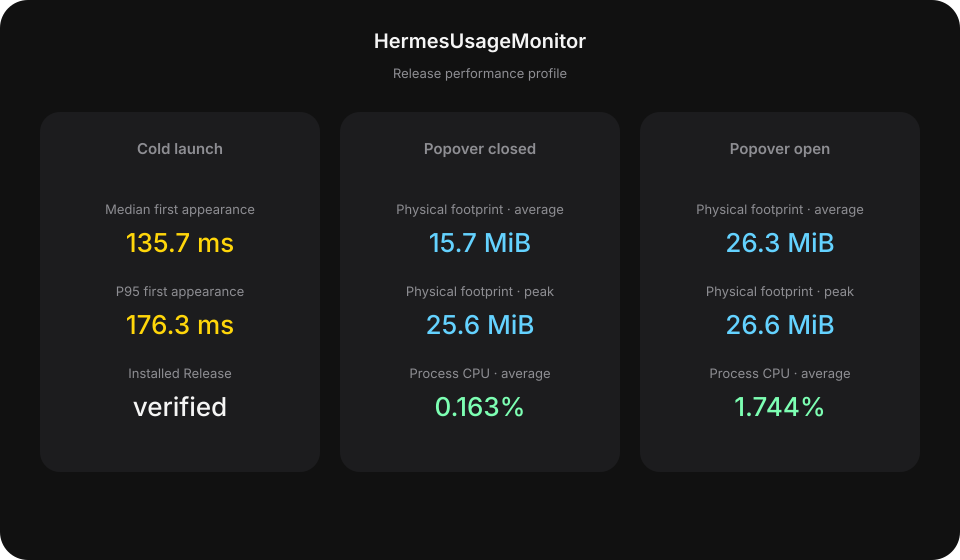

<p align="center">
  
  
</p>

<div align="center">
  <h1>HermesUsageMonitor</h1>
  <p>Native SwiftUI macOS menu bar utility for monitoring AI subscription quotas and Hermes Agent usage.</p>
</div>

## What it is

- macOS 26+ menu bar app built with SwiftUI `MenuBarExtra`
- Live quota cards for ChatGPT and OpenCode Go
- Provider reset countdowns and verified reset notifications
- Hermes usage accounting for the rolling 30-day window
- Manual reset redemption flow with explicit verification
- Read-only integration with provider quota data and Hermes runtime data

## How it works

1. A bundled `hermes-usage-bridge` reads provider quota snapshots through the existing Hermes environment.
2. The app validates provider and quota-window identity, then aggregates profiles by subscription.
3. Hermes `state.db` is read through SQLite for local token, request, model, and cost accounting.
4. Reset notifications are emitted only for a verified transition: usage changes from above 0% to 0% and the provider reset timestamp advances.

Credentials stay in Hermes. HermesUsageMonitor stores no provider secrets and never derives official quota percentages from local accounting.

## Screenshots


## Performance

Idle measurements of the installed Release app on Mac14,9, macOS 26.5 build 25F71, arm64. Physical footprint is the quantity Activity Monitor displays, not RSS.

<p align="center">
  
</p>

The numbers come from `make profile`. They are not a historical HUD record.

## Build

```bash
make build
```

The Makefile builds, signs, installs, and launches `HermesUsageMonitor.app` in `~/Applications`.

## Profiling

```bash
make profile
```

The command measures the installed Release app at idle: cold-launch timing, plus separate CPU and physical-footprint profiles for the popover-closed and popover-open states. It does not compare the two states. It refuses to measure when the installed app is not the live process. It writes [`scripts/resource-baseline.json`](scripts/resource-baseline.json) and regenerates the chart above. A missing baseline fails the renderer; it never substitutes a value.

