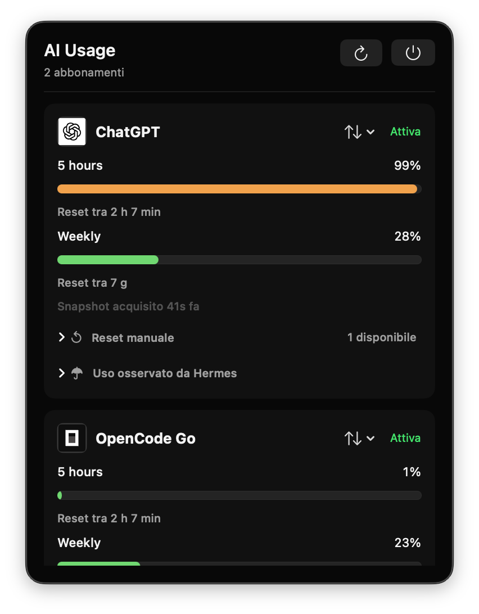

<p align="center">
  
  
</p>

<div align="center">
  <h1>HermesUsageMonitor</h1>
  <p>Native SwiftUI macOS menu bar utility for monitoring AI subscription quotas and Hermes Agent usage.</p>
</div>

## What it is

- macOS 26+ menu bar app built with SwiftUI `MenuBarExtra`
- Live quota cards for ChatGPT and OpenCode Go
- Provider reset countdowns and verified reset notifications
- Hermes usage accounting for the rolling 30-day window
- Manual reset redemption flow with explicit verification
- Read-only integration with provider quota data and Hermes runtime data

## How it works

1. A bundled `hermes-usage-bridge` reads provider quota snapshots through the existing Hermes environment.
2. The app validates provider and quota-window identity, then aggregates profiles by subscription.
3. Hermes `state.db` is read through SQLite for local token, request, model, and cost accounting.
4. Reset notifications are emitted only for a verified transition: usage changes from above 0% to 0% and the provider reset timestamp advances.

Credentials stay in Hermes. HermesUsageMonitor stores no provider secrets and never derives official quota percentages from local accounting.

## Screenshots



## Performance

Measured on 20 cold launches of the installed Release app, up to the first menu bar identity appearance:

| Metric | Result |
| --- | ---: |
| Median | 135.720 ms |
| P95 | 176.255 ms |
| P95 budget | 211.506 ms |

The measurement is tied to the installed Release executable and its SHA-256 baseline in [`scripts/launch-baseline.json`](scripts/launch-baseline.json).

## Build

```bash
make build
```

The Makefile builds, signs, installs, and launches `HermesUsageMonitor.app` in `~/Applications`.

